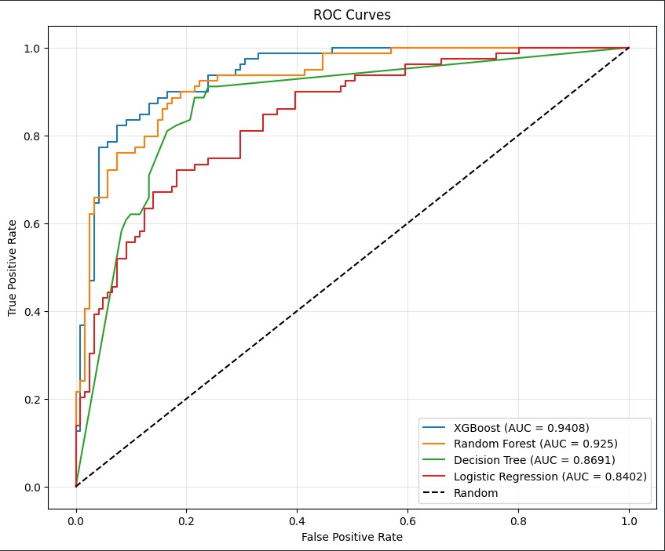
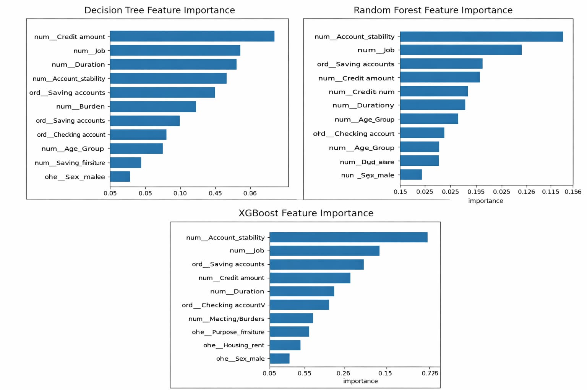
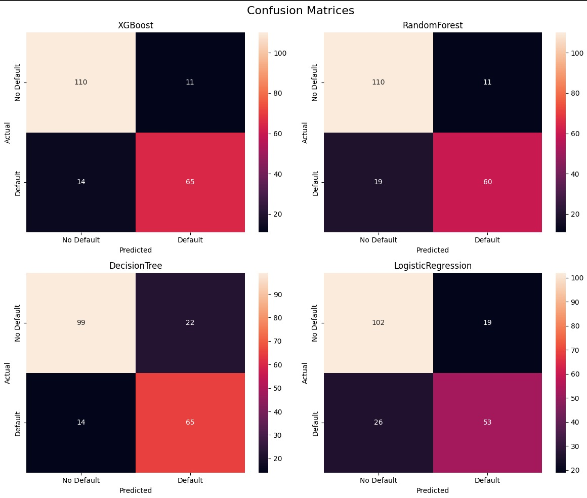

# Production-Ready Credit Risk Classification System

## Overview

This project presents a production-oriented machine learning system designed to assess credit risk and classify loan applicants as **Low Risk** or **High Risk**.

The objective is not just model accuracy, but building a reliable, interpretable, and business-aligned decision system suitable for real-world financial deployment.

The pipeline covers data preprocessing, imbalance handling, model comparison, evaluation, and business interpretation.

---

## Problem Statement

Financial institutions face significant losses due to loan defaults. A poorly calibrated risk model can either:

- Approve high-risk applicants → leading to financial losses  
- Reject low-risk applicants → leading to opportunity cost  

This project builds a classification system that minimizes default risk while maintaining approval efficiency.

---

## Dataset

The dataset contains structured financial and demographic features such as:

- Age  
- Job quantity
- Credit amount  
- Duration  
- Housing status  
- Existing credits  
- Loan purpose  

The target variable indicates whether an applicant is **Good Risk** or **Bad Risk**.

Class imbalance is present, requiring specialized handling.

---

## Project Architecture

### 1. Data Preprocessing
- Missing value treatment  
- Encoding categorical variables  
- Feature scaling  
- Exploratory Data Analysis  
- Outlier inspection  

### 2. Imbalance Handling 
- Class distribution validation  

### 3. Model Training

The following models were implemented (with hyperparameter tuning) and compared:

- Logistic Regression  
- Random Forest  
- Gradient Boosting  
- XGBoost  

### 4. Model Evaluation

Evaluation metrics included:

- Accuracy  
- Precision  
- Recall  
- F1-Score  
- ROC-AUC  
- Confusion Matrix  
- Precision-Recall Curve  

Business-sensitive interpretation prioritized recall for high-risk detection.

---

## Key Results

- Tree-based ensemble models outperformed linear models.
- XGBoost delivered the best balance between recall and precision.
- SMOTE significantly improved minority-class detection.
- Feature importance analysis revealed strong influence from credit amount, loan duration, and existing credit history.
---

## Model Performance

| Model | Accuracy | Recall (Bad Risk) | F1-Score (Bad Risk) | ROC-AUC |
|-------|----------|-------------------|----------------------|---------|
| XGBoost | 0.875 | 0.8228 | 0.8387 | 0.9408 |
| Random Forest | 0.850 | 0.7595 | 0.8000 | 0.9250 |
| Decision Tree | 0.820 | 0.8228 | 0.7831 | 0.8691 |
| Logistic Regression | 0.775 | 0.6709 | 0.7020 | 0.8402 |

> XGBoost selected as the best model — highest ROC-AUC (0.9408) and strongest recall for bad-risk detection.
---

## Business Interpretation

In credit risk modeling, false negatives are more dangerous than false positives.

Approving a high-risk borrower directly impacts revenue and capital reserves. Therefore:

- Recall for bad-risk classification is prioritized.
- The model can be tuned further based on institutional risk appetite.
- Threshold adjustments allow strategic risk control.

This makes the system adaptable to real-world financial policy constraints.

---

## Results

### ROC Curve


### Feature Importance


### Confusion Matrices


---

## Repository Structure

```
Credit-Risk-Classification/
│
├── Notebooks/
│   ├── 01_EDA_Preprocessing.ipynb
│   ├── 02_Model_Development.ipynb
│   └── 03_Model_Evaluation.ipynb
│
├── Models/
│   ├── decision_tree.pkl
│   ├── logistic_regression.pkl
│   ├── random_forest.pkl
│   └── xgboost.pkl
│
├── Data/
│   ├── X_train.pkl
│   ├── X_test.pkl
│   ├── y_train.pkl
│   └── y_test.pkl
│
├── Evaluation_Metrics/
│   └── all_model_metrics.pkl
│
├── Report/
│   └── Technical_Report.pdf
│
├── Visualizations/
│   ├── Confusion_matrices.png
│   ├── Correlation_heatmap.png
│   ├── Feature_importance.png
│   ├── Precision_recall_curve_xgboost.png
│   └── ROC_curve.png
│
├── requirements.txt
└── README.md
```
---

## How to Run

1. Clone the repository:
   git clone https://github.com/Kuvam210/production-ready-credit-risk-classification.git


2. Install dependencies:
   pip install -r requirements.txt


3. Launch Jupyter Notebook:
   jupyter notebook


4. Run notebooks sequentially:
   - Data Preprocessing  
   - Model Training  
   - Evaluation  

---

## Technologies Used

- Python  
- Pandas  
- NumPy  
- Scikit-Learn  
- XGBoost  
- Matplotlib  
- Seaborn  
- Imbalanced-Learn  

---

## Production Considerations

For real-world deployment:

- Add model serialization using joblib or pickle  
- Build a REST API using FastAPI or Flask  
- Implement monitoring for data and prediction drift  
- Introduce automated retraining pipeline  

---

## Author

Kuvam Sharma | ECE Undergraduate | Machine Learning Enthusiast  
Focused on building scalable, business-aligned AI systems.
